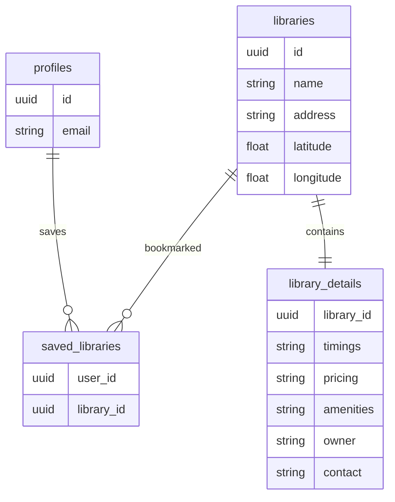

<div align="center">

# 📚 ShelfSpace

### Discover Libraries & Study Spaces Near You

Find libraries with **pricing, timings, amenities, ratings, and real-time locations** on an interactive map.

<p>
  
  
  
  
  
  
</p>

<p>
<a href="#">🌐 Live Demo</a> •
<a href="https://github.com/shubhitiwariiii/shelfspace">📂 Repository</a> •
<a href="https://github.com/shubhitiwariiii/shelfspace/issues">🐛 Report Bug</a> •
<a href="https://github.com/shubhitiwariiii/shelfspace/issues">💡 Request Feature</a>
</p>

---

## 📸 Project Preview

### 🏠 Landing Page

<p align="center">


</p>

---

### 🗺️ Explore Libraries

<p align="center">


</p>

---

### 📖 Library Details

<p align="center">


</p>

---

### Login/signup

<p align="center">


</p>

---

## 🎯 About

ShelfSpace helps students discover **libraries and paid study spaces** without relying on incomplete or outdated map listings.

Unlike traditional map services, ShelfSpace combines **real OpenStreetMap locations** with **verified information** like pricing, operating hours, amenities, seating capacity, WiFi availability, and contact details.

The project is built around a scalable data ingestion pipeline, allowing new districts or states to be added without changing application logic.

---

## ✨ Features

| Feature                  | Description                                |
| ------------------------ | ------------------------------------------ |
| 🗺️ Interactive Map      | Explore nearby libraries visually          |
| 📍 Smart Search          | Search by district or state                |
| 📚 Detailed Profiles     | Pricing, timings, amenities, owner details |
| ❤️ Save Libraries        | Bookmark favourite study spaces            |
| 🔐 Secure Authentication | Supabase Auth                              |
| ⭐ Ratings                | Community ratings (where available)        |
| 📱 Responsive UI         | Optimized for desktop & mobile             |
| ⚡ Fast Performance       | Built with Next.js App Router              |

---

## 🛠 Tech Stack

| Category       | Technology                               |
| -------------- | ---------------------------------------- |
| Framework      | Next.js 14                               |
| Language       | TypeScript                               |
| Styling        | Tailwind CSS                             |
| Backend        | Supabase                                 |
| Database       | PostgreSQL                               |
| Authentication | Supabase Auth                            |
| Maps           | Google Maps JavaScript API               |
| Geodata        | OpenStreetMap (Overpass API + Nominatim) |
| Hosting        | Vercel                                   |

---

# 🏗 Architecture

               🌍 OpenStreetMap
                      │
          ┌───────────┴───────────┐
          │                       │
   Overpass API             Nominatim
          │                       │
          └───────────┬───────────┘
                      │
          ⚙️ Data Ingestion Script
                      │
                 UPSERT DATA
                      │
          🗄️ Supabase PostgreSQL
       ┌────────┼──────────┬─────────┐
       │        │          │         │
  Libraries  Details   Profiles   Bookmarks
       └────────┼──────────┴─────────┘
                │
         ⚡ Next.js Application
      ┌─────────┼─────────┬─────────┐
      │         │         │         │
   Landing   Explore   Details   Dashboard
   
---

# 🗄 Database Schema



---


## 📂 Folder Structure

```text
ShelfSpace
│
├── app/
│   ├── (auth)/
│   ├── dashboard/
│   ├── explore/
│   ├── library/
│   └── api/
│
├── components/
│
├── lib/
│
├── scripts/
│   └── fetch-libraries.ts
│
├── public/
│   └── readme/
│       ├── landing.png
│       ├── explore.png
│       ├── details.png
│       └── dashboard.png
│
├── supabase/
│   ├── schema.sql
│   └── seed.sql
│
├── package.json
├── tsconfig.json
├── next.config.js
└── README.md
```
---

# ⚡ Engineering Highlights

* ✔ Real geographic data from OpenStreetMap
* ✔ Provider-agnostic database design
* ✔ Idempotent data ingestion pipeline
* ✔ Row Level Security (RLS)
* ✔ Manual enrichment workflow
* ✔ Scalable architecture
* ✔ Bookmark system with authenticated users
* ✔ Separation of scraped and verified data

---

# 🚀 Getting Started

## Clone Repository

```bash
git clone https://github.com/shubhitiwariiii/shelfspace.git

cd shelfspace
```

---

## Install Dependencies

```bash
npm install
```

---

## Configure Environment Variables

Create a `.env.local`

```env
NEXT_PUBLIC_SUPABASE_URL=

NEXT_PUBLIC_SUPABASE_ANON_KEY=

SUPABASE_SECRET_KEY=

NEXT_PUBLIC_GOOGLE_MAPS_API_KEY=
```

---

## Setup Database

Run

```
supabase/schema.sql
```

inside the Supabase SQL Editor.

---

## Fetch Library Data

```bash
npm run fetch-libraries
```

This imports real library locations from OpenStreetMap.

---

## Run Development Server

```bash
npm run dev
```

Visit

```
http://localhost:3000
```

---

# 🚀 Roadmap

* ✅ Project Setup
* ✅ Supabase Integration
* ✅ OpenStreetMap Pipeline
* ✅ Database Schema
* ✅ Row Level Security
* ✅ Landing Page
* ✅ Explore Page
* ⏳ Library Details
* ⏳ Authentication
* ⏳ Saved Dashboard
* ⏳ Search Filters
* ⏳ Mobile Optimization
* ⏳ Admin Dashboard

---

# 💡 Future Improvements

* AI-based library recommendations
* User reviews & ratings
* Open now filter
* Nearby libraries
* Admin verification dashboard
* Image gallery
* Availability status
* Analytics dashboard

---

# 👩‍💻 Author

**Shubhi Tiwari**

B.Tech CSE (AI & ML)

<p>
<a href="https://github.com/shubhitiwariiii">

</a>

<a href="https://linkedin.com/in/shubhi-tiwari-664553329">

</a>
</p>

---

<div align="center">

## ⭐ If you found this project useful, please consider giving it a star!

Made with ❤️ using Next.js, TypeScript, Tailwind CSS & Supabase.

</div>
