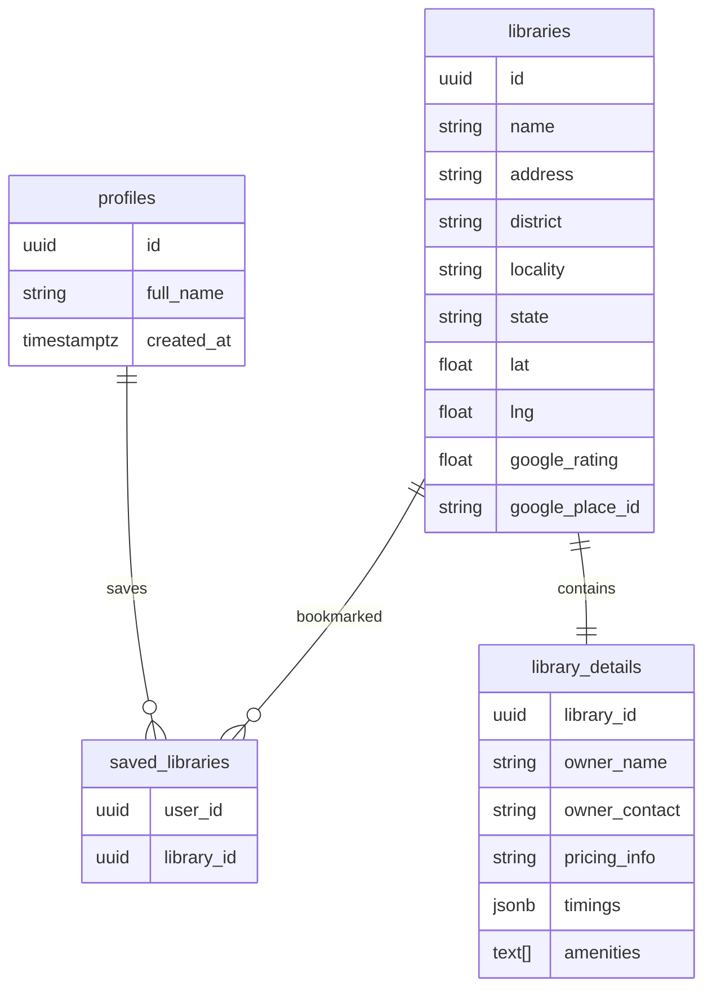

<div align="center">

# 📚 ShelfSpace

### Discover Libraries & Study Spaces Near You

Find libraries with **pricing, timings, amenities, and real-time location search** on an interactive map.

<p>
  
  
  
  
  
  
  
</p>

<p>
<a href="#">🌐 Live Demo</a> •
<a href="https://github.com/shubhitiwariiii/library-finder">📂 Repository</a> •
<a href="https://github.com/shubhitiwariiii/library-finder/issues">🐛 Report Bug</a> •
<a href="https://github.com/shubhitiwariiii/library-finder/issues">💡 Request Feature</a>
</p>

---

## 📸 Project Preview

### 🏠 Landing Page

<p align="center">


</p>

---

### 🗺️ Explore Libraries

<p align="center">

</p>

---

### 📖 Library Details

<p align="center">

</p>

---

### 🔐 Login / Signup

<p align="center">


</p>

---

## 🎯 About

ShelfSpace helps students discover **libraries and paid study spaces** without relying on incomplete or outdated map listings.

Unlike traditional map services, ShelfSpace combines **real OpenStreetMap locations** with **verified information** like pricing, operating hours, amenities, and contact details — the things a map pin alone never tells you.

The project is built around a scalable data ingestion pipeline. Adding a new district or state means editing an array in one script and rerunning it — no changes to application code required.

---

## ✨ Features

| Feature | Description |
|---|---|
| 🗺️ Interactive Map | Explore libraries visually via Leaflet + OpenStreetMap tiles (free, no billing required) |
| 📍 Geolocation Search | "Near me" button finds libraries within 50km using real Haversine distance calculation |
| 🔍 Search-First UX | Explore page shows nothing until the user searches — no irrelevant pre-loaded lists |
| 📚 Detailed Profiles | Pricing, timings, amenities, owner details per library |
| 🔖 Bookmark Libraries | Save favourite study spaces from any card or detail page |
| 🔄 State-Preserving Nav | Search/location state persists in URL — going back from a detail page restores your exact previous search |
| 🔐 Secure Auth | Supabase Auth with email/password, DB trigger auto-creates user profile on signup |
| 📱 Responsive UI | Tested across mobile and desktop |
| ⚡ Skeleton Loading | Next.js `loading.tsx` convention used across all data-fetching routes |
| 🏗️ Real Data Pipeline | OpenStreetMap Overpass API + Nominatim geocoding, idempotent upserts keyed by OSM ID |

---

## 🛠 Tech Stack

| Category | Technology |
|---|---|
| Framework | Next.js 16 (App Router) |
| Language | TypeScript |
| Styling | Tailwind CSS v4 |
| Backend / DB | Supabase (PostgreSQL + Auth + RLS) |
| Maps | Leaflet + OpenStreetMap tiles (free, no API key needed) |
| Geodata source | OpenStreetMap — Overpass API + Nominatim geocoding |
| Distance calc | Haversine formula (`src/lib/distance.ts`) |
| Hosting | Vercel |

---

## 🏗 Architecture

                 OpenStreetMap
                 (Overpass API)
                        │
                Nominatim Geocoder
                        │
        scripts/fetch-libraries.ts
        (manual, idempotent upsert)
                        │
                ┌──────────────────┐
                │     Supabase     │
                │ PostgreSQL + RLS │
                └──────────────────┘
                        │
        ┌───────────────┼───────────────┐
        │               │               │
 Authentication    Library Data    Saved Libraries
        │               │               │
        └───────────────┼───────────────┘
                        │
              Next.js Application
                        │
   Landing → Explore → Details → Dashboard

---

## 🗄 Database Schema



---

## 📂 Folder Structure


ShelfSpace/
├── src/
│   ├── app/
│   │   ├── explore/
│   │   ├── dashboard/
│   │   ├── library/
│   │   │   └── [id]/
│   │   ├── login/
│   │   └── signup/
│   │
│   ├── components/
│   │   ├── Navbar.tsx
│   │   ├── SaveButton.tsx
│   │   ├── SaveIconButton.tsx
│   │   ├── BackButton.tsx
│   │   └── NearbyLibraries.tsx
│   │
│   ├── lib/
│   │   ├── supabase/
│   │   │   ├── client.ts
│   │   │   └── server.ts
│   │   ├── queries/
│   │   │   └── libraries.ts
│   │   └── distance.ts
│   │
│   └── scripts/
│       └── fetch-libraries.ts
│
├── public/
├── package.json
└── README.md

---

## ⚡ Engineering Highlights

- **Real geographic data** from OpenStreetMap — not mocked, not hardcoded
- **Provider-agnostic schema** — data source can switch from OSM to Google Places without touching frontend code
- **Idempotent ingestion pipeline** — re-running the script never creates duplicates, keyed by source ID
- **Row Level Security (RLS)** on every table — public read for libraries, strictly user-scoped writes for saved lists and profiles
- **Separation of scraped vs verified data** — `libraries` holds auto-ingested location data; `library_details` holds manually verified pricing/timings/owner info
- **Client-safe module separation** — `distance.ts` is kept separate from `queries/libraries.ts` because the latter imports `next/headers` (server-only), and mixing them breaks client components
- **URL-based explore state** — search query and location coordinates live in the URL (`?q=...&lat=...&lng=...`), not just React state, so navigating to a detail page and back restores the exact previous search context
- **50km geolocation radius filter** — "Near me" hides libraries beyond a real-world useful distance rather than sorting them to the bottom

---

## 🚀 Getting Started

### Clone Repository

```bash
git clone https://github.com/shubhitiwariiii/library-finder.git
cd library-finder
```

### Install Dependencies

```bash
npm install
```

### Configure Environment Variables

Create `.env.local`:

```env
NEXT_PUBLIC_SUPABASE_URL=your_supabase_project_url
NEXT_PUBLIC_SUPABASE_ANON_KEY=your_supabase_publishable_key
SUPABASE_SECRET_KEY=your_supabase_secret_key
```

### Setup Database

Run the schema SQL in your Supabase SQL Editor to create all four tables with RLS policies pre-configured. Also run the profile auto-creation trigger:

```sql
create or replace function public.handle_new_user()
returns trigger as $$
begin
  insert into public.profiles (id, full_name)
  values (new.id, new.raw_user_meta_data->>'full_name');
  return new;
end;
$$ language plpgsql security definer;

create trigger on_auth_user_created
  after insert on auth.users
  for each row execute function public.handle_new_user();
```

### Fetch Library Data

```bash
npm run fetch-libraries
```

Pulls real library locations from OpenStreetMap for the districts defined in `AREAS` inside `scripts/fetch-libraries.ts`. Add new cities by extending that array and re-running — no other changes needed.

### Run Locally

```bash
npm run dev
```

Visit `http://localhost:3000`

---

## 🗺️ Roadmap

- ✅ Project setup + Supabase integration
- ✅ OpenStreetMap ingestion pipeline
- ✅ Database schema with RLS policies
- ✅ Dark editorial landing page with live stats
- ✅ Geolocation-based "Closest to You" homepage section
- ✅ Explore page
  - Search-first interface
  - Geolocation sorting
  - 50 km radius filter
- ✅ Interactive map view (Leaflet + OpenStreetMap tiles)
- ✅ Library detail pages
- ✅ Authentication (Email/Password via Supabase Auth)
- ✅ Saved Libraries dashboard with stats and quick actions
- ✅ Bookmarking from list cards and detail pages
- ✅ Login redirect + auto-save flow for unauthenticated bookmarks
- ✅ URL-preserved Explore state (restores search context on back navigation)
- ✅ Skeleton loading states across all routes
- ✅ Mobile responsive

### 🚧 In Progress
- ⏳ Manual data enrichment (pricing, timings, owner details)
- ⏳ Locality-level data (column added, data entry pending)
- ⏳ Admin enrichment interface
- ⏳ User reviews and ratings

---

## 💡 Future Improvements

- AI-based library recommendations
- Image gallery per library
- Availability / seat-count status
- Analytics dashboard
- Library owner verification flow
- Push notifications for saved library updates

---

## 👩‍💻 Author

**Shubhi Tiwari**
<p>
<a href="https://github.com/shubhitiwariiii">

</a>
<a href="https://linkedin.com/in/shubhi-tiwari-664553329">

</a>
</p>

---

<div align="center">

⭐ If you found this project useful, please consider giving it a star!

Made with ❤️

</div>
