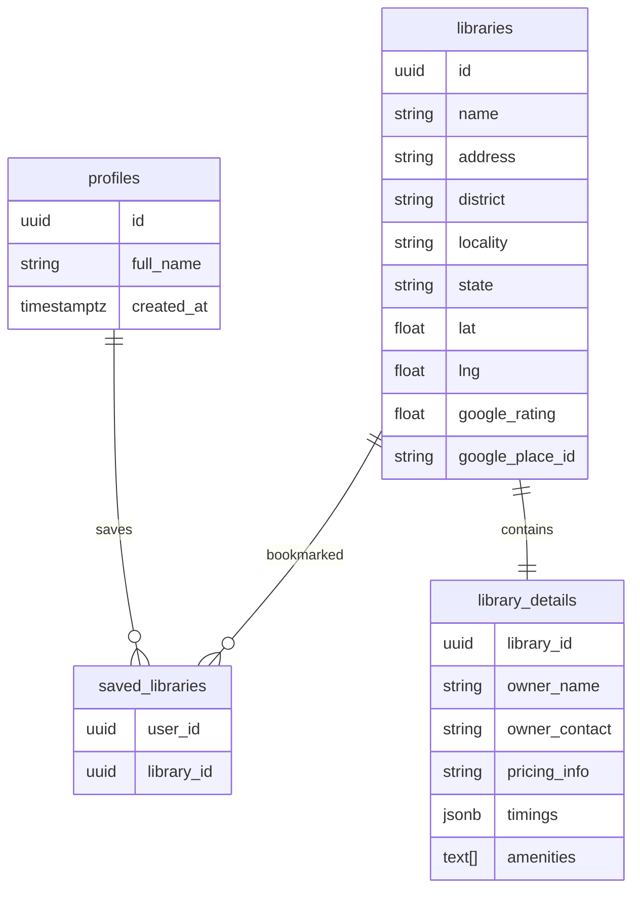

<div align="center">

# 📚 ShelfSpace

### Find libraries and study spaces near you — pricing, timings, and amenities a map pin alone never tells you.

<p>
  
  
  
  
  
  
</p>

<p>
  <a href="#">🌐 Live Demo</a> •
  <a href="https://github.com/shubhitiwariiii/library-finder">📂 Repository</a> •
  <a href="https://github.com/shubhitiwariiii/library-finder/issues">🐛 Report Bug</a> •
  <a href="https://github.com/shubhitiwariiii/library-finder/issues">💡 Request Feature</a>
</p>

</div>

---

## 🎯 About

ShelfSpace is a library discovery platform built for students who are tired of showing up to locked gates or paying surprise fees. It pulls real library locations from OpenStreetMap, plots them on an interactive map, and layers in verified details — pricing, timings, owner contact, amenities — that no map pin tells you by default.

This isn't a demo built on hardcoded data. It's architected around a real ingestion pipeline that scales to any district or state, with a clean separation between data that can be scraped and data that needs manual verification.

---

## ⚡ Engineering Highlights

> The parts that matter to a technical reviewer.

- **Real data pipeline** — OpenStreetMap Overpass API + Nominatim geocoding; not mocked, not hardcoded. Adding a new city means editing one array and rerunning a script — zero application code changes.
- **Idempotent upserts** — re-running ingestion never creates duplicates, keyed by source ID. Re-run as many times as needed safely.
- **Provider-agnostic schema** — `libraries` and `library_details` are designed so the data source (currently OSM) can be swapped for Google Places or any other API without touching frontend code.
- **Separation of scraped vs verified data** — `libraries` holds auto-ingested coordinates and names; `library_details` holds manually verified pricing/timings/owner info. The schema never pretends to have data it doesn't.
- **Row Level Security (RLS)** on every table — public read for library data, strictly user-scoped writes for saved lists and profiles. Enforced at the database layer, not just application logic.
- **URL-based explore state** — search query and geolocation coordinates live in the URL (`?q=...&lat=...&lng=...`), not just React state. Navigating to a detail page and back restores the exact previous search context without re-requesting location permission.
- **Client-safe module separation** — `distance.ts` is deliberately kept separate from `queries/libraries.ts`, which imports `next/headers` (server-only). Mixing them silently breaks client components — a known Next.js App Router footgun that this architecture avoids by design.
- **Haversine distance calculation** — "Near me" uses real great-circle distance math, not flat Pythagorean approximation. Libraries beyond 50km are filtered out entirely, not sorted to the bottom.
- **Auth via DB trigger** — user profile creation happens server-side via a Postgres trigger on `auth.users` insert, not a client-side insert after signup. Eliminates race conditions and RLS timing issues that break the naive approach.
- **Dynamic map import** — Leaflet is loaded with `ssr: false` via Next.js `dynamic()` to prevent the `window is not defined` crash that happens when Leaflet's module code runs during server-side rendering.

---

## ✨ Features

| Feature | Description |
|---|---|
| 🗺️ Interactive Map | Leaflet + OpenStreetMap tiles — free, no billing, no API key |
| 📍 Geolocation Search | "Near me" finds libraries within 50km using Haversine distance |
| 🔍 Search-First UX | Explore page starts empty — no irrelevant pre-loaded lists |
| 🔄 State-Preserving Nav | Back button restores exact previous search via URL state |
| 🔖 Smart Bookmarks | Save from list cards or detail pages; auto-saves on login redirect |
| 📚 Verified Profiles | Pricing, timings, amenities, owner details per library |
| 🔐 Secure Auth | Supabase Auth + DB trigger profile creation |
| 📊 User Dashboard | Saved libraries, stats, district-based quick actions |
| ⚡ Skeleton Loading | `loading.tsx` convention across all data-fetching routes |
| 📱 Responsive | Tested across mobile and desktop viewports |

---

## 🛠 Tech Stack

| Category | Technology |
|---|---|
| Framework | Next.js 16 (App Router) |
| Language | TypeScript |
| Styling | Tailwind CSS v4 |
| Backend / DB | Supabase (PostgreSQL + Auth + RLS) |
| Maps | Leaflet + OpenStreetMap tiles |
| Geodata | OpenStreetMap — Overpass API + Nominatim |
| Distance | Haversine formula (`src/lib/distance.ts`) |
| Hosting | Vercel |

---

## 🏗 Architecture

```text
                    OpenStreetMap
                  (Overpass API)
                         │
               Nominatim Geocoder
                         │
          scripts/fetch-libraries.ts
          (run manually, idempotent upsert)
                         │
                ┌─────────────────────┐
                │       Supabase       │
                │  PostgreSQL + RLS    │
                └────────┬────────────┘
                         │
         ┌───────────────┼───────────────┐
         │               │               │
    Authentication   Library Data   Saved Libraries
         │               │               │
         └───────────────┴───────────────┘
                         │
                  Next.js Application
                         │
       Landing → Explore → Details → Dashboard
```

---

## 🗄 Database Schema



---

## 📸 Screenshots

### 🏠 Landing Page
<p align="center">


</p>

### 🗺️ Explore Libraries
<p align="center">

</p>

### 📖 Library Details
<p align="center">

</p>

### 🔐 Login / Signup
<p align="center">


</p>

---

## 🚀 Getting Started

### 1. Clone and Install

```bash
git clone https://github.com/shubhitiwariiii/library-finder.git
cd library-finder
npm install
```

### 2. Environment Variables

Create `.env.local`:

```env
NEXT_PUBLIC_SUPABASE_URL=your_supabase_project_url
NEXT_PUBLIC_SUPABASE_ANON_KEY=your_supabase_publishable_key
SUPABASE_SECRET_KEY=your_supabase_secret_key
```

### 3. Database Setup

Run the schema SQL in your Supabase SQL Editor (creates all four tables with RLS policies). Then add the profile trigger:

```sql
create or replace function public.handle_new_user()
returns trigger as $$
begin
  insert into public.profiles (id, full_name)
  values (new.id, new.raw_user_meta_data->>'full_name');
  return new;
end;
$$ language plpgsql security definer;

create trigger on_auth_user_created
  after insert on auth.users
  for each row execute function public.handle_new_user();
```

### 4. Fetch Library Data

```bash
npm run fetch-libraries
```

Pulls real library locations from OpenStreetMap for the districts defined in `AREAS` inside `scripts/fetch-libraries.ts`. Add new cities by extending that array — no other changes needed.

### 5. Run

```bash
npm run dev
```

Visit `http://localhost:3000`

---

## 📂 Folder Structure

```text
ShelfSpace/
│
├── src/
│   ├── app/
│   │   ├── explore/           # Search-first discovery page
│   │   ├── dashboard/         # Saved libraries + user stats
│   │   ├── library/[id]/      # Library detail page
│   │   ├── login/
│   │   └── signup/
│   │
│   ├── components/
│   │   ├── Navbar.tsx
│   │   ├── SaveButton.tsx         # Full save button (detail page)
│   │   ├── SaveIconButton.tsx     # Compact bookmark icon (list cards)
│   │   ├── BackButton.tsx         # router.back() — preserves URL search state
│   │   └── NearbyLibraries.tsx    # Geolocation-based homepage preview
│   │
│   └── lib/
│       ├── supabase/
│       │   ├── client.ts      # Browser Supabase client
│       │   └── server.ts      # Server Supabase client (next/headers)
│       ├── queries/
│       │   └── libraries.ts   # All DB query functions
│       └── distance.ts        # Haversine formula (client-safe, no server imports)
│
├── scripts/
│   └── fetch-libraries.ts     # OSM ingestion script
│
├── package.json
└── README.md
```

---

## 🗺️ Roadmap

- ✅ Project setup + Supabase integration
- ✅ OpenStreetMap ingestion pipeline
- ✅ Database schema with RLS policies
- ✅ Dark editorial landing page with live stats
- ✅ Geolocation-based "Closest to you" homepage section
- ✅ Explore page — search-first, geolocation sort, 50km radius filter
- ✅ Interactive map view (Leaflet + OSM tiles, free)
- ✅ Library detail pages
- ✅ Authentication (email/password + Supabase Auth)
- ✅ Saved libraries dashboard with stats and quick actions
- ✅ Bookmark from list cards and detail pages
- ✅ Login-redirect-and-auto-save flow for unauthenticated bookmark clicks
- ✅ URL-preserved explore state (back navigation restores search context)
- ✅ Skeleton loading states across all routes
- ✅ Mobile responsive
- ⏳ Manual data enrichment (pricing/timings/owner for existing libraries)
- ⏳ Locality-level data (column exists, data entry pending)
- ⏳ Admin enrichment interface
- ⏳ User reviews and ratings
- ⏳ "Open now" filter
- ⏳ Expand coverage beyond Lucknow and Greater Noida

---

## 💡 Future Improvements

- AI-based library recommendations
- Image gallery per library
- Seat availability / capacity status
- Analytics dashboard
- Library owner verification flow
- Push notifications for saved library updates

---

## 👩‍💻 Author

**Shubhi Tiwari**

<p>
<a href="https://github.com/shubhitiwariiii">

</a>
<a href="https://linkedin.com/in/shubhi-tiwari-664553329">

</a>
</p>

---

<div align="center">

⭐ If you found this project useful, please consider giving it a star!

Made with ❤️

</div>
